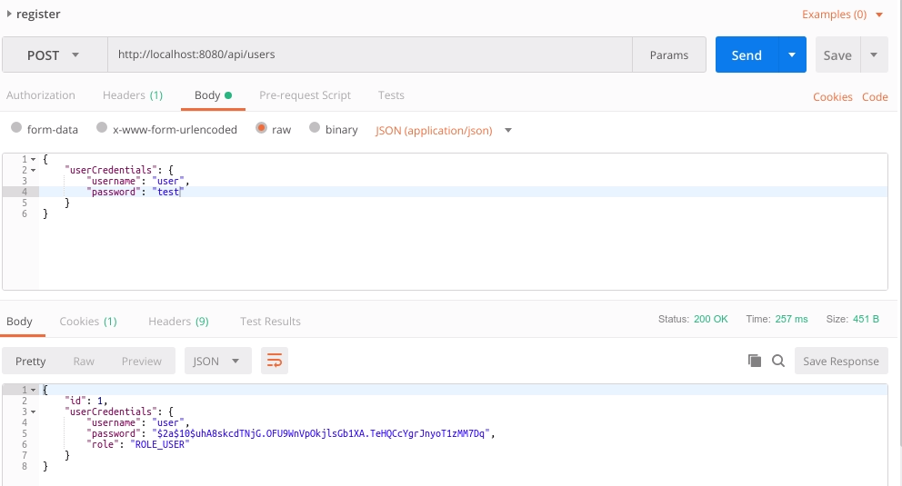
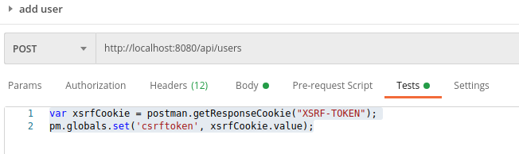
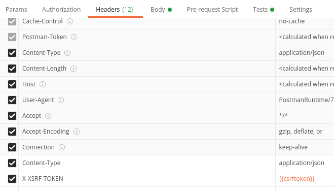
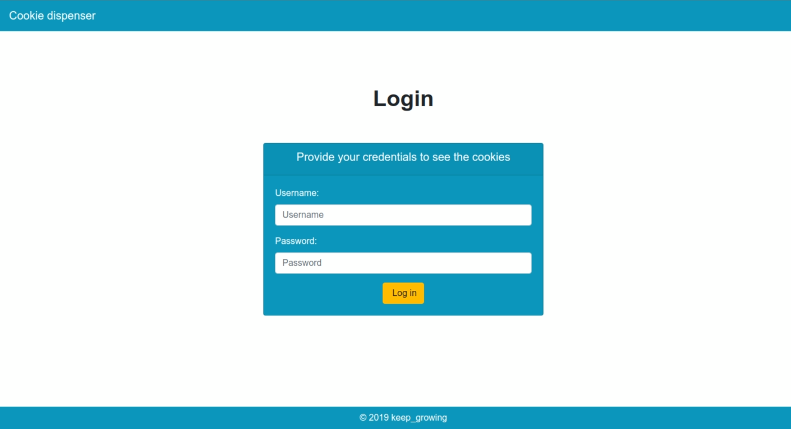
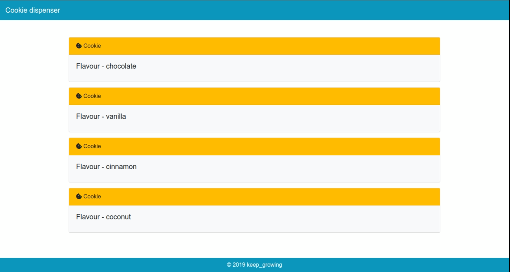

# jwt-spring-boot-angular-scaffolding


This project is a multi-module application, using Spring Boot for the backend and Angular for the frontend. The project can be built into a single jar file using Maven. You can also run the modules separately during development.

The backend and frontend are secured with JSON Web Token.

To learn how to set up a project like this one, check out the following posts:

* [Securing your Spring Boot and Angular app with JWT #1 – Introduction](https://keepgrowing.in/java/springboot/securing-your-spring-boot-and-angular-app-with-jwt-1-introduction/)
* [Securing your Spring Boot and Angular app with JWT #2 – Backend](https://keepgrowing.in/java/springboot/securing-your-spring-boot-and-angular-app-with-jwt-2-backend/)
* [Securing your Spring Boot and Angular app with JWT #3 – Frontend](https://keepgrowing.in/angular/securing-your-spring-boot-and-angular-app-with-jwt-3-frontend/)
* [Fix “Invalid CSRF token” error – add the XSRF-TOKEN header in Angular](https://keepgrowing.in/angular/fix-invalid-csrf-token-error-add-the-xsrf-token-header-in-angular/) (when you enable csrf protection in `SecurityConfig::configure`)

## Getting Started

To clone the repository, run in the command line:
```bash
$ git clone https://github.com/little-pinecone/jwt-spring-boot-angular-scaffolding.git
```

You can build the application with:
```bash
$ mvn clean install
```

### Sign up request

You need to create a test user:



* path: ```http://localhost:8080/api/users```

* body:

```json
{
    "userCredentials": {
        "username": "user",
        "password": "test"
    }
}
```

#### Add CSRF token to requests from Postman

* Copy this code to the `Tests` tab for the mutable requests:

```
var xsrfCookie = postman.getResponseCookie("XSRF-TOKEN");
pm.globals.set('csrftoken', xsrfCookie.value);
```



* Add the `X-XSRF-TOKEN` header that will use the `{{csrftoken}}` variable:



## Overview and technical features

* The project currently serves a login page and hard-coded pastry data returned from the API.
* It allows registering new users, handles login requests.
* It serves data from the API to authenticated and authorized users.
* The user experience is enhanced thanks to the AuthGuard implementation.

## Running tests

Run all backend tests with the following command in the root directory:
```bash
$ mvn test
```
Run all frontend tests with the following command in the `frontend/src/main/angular` directory:
```bash
$ ng test
```

## Running in production

Set the `target` url in `frontend/src/main/angular/src/proxy.conf.json` to the path for the right environment.
Add the `"changeOrigin": true` option if your backend is not running on `localhost` ([Angular proxy documentation](https://angular.io/guide/build#proxying-to-a-backend-server)). 

Override the default `TokenProperties` values. E.g. to override the expiration time of tokens you can add `security.jwt.expiration=your_value` to the `application.properties` file.

## Built With

* Java 11
* [Spring Boot 2.1.5](https://start.spring.io/), updated to Spring Boot 2.2.4 
* [Angular 6](https://angular.io/), updated to Angular 10
* [Bootstrap 4](https://getbootstrap.com/)
* [Maven](https://maven.apache.org/)
* [frontend-maven-plugin](https://github.com/eirslett/frontend-maven-plugin)
* [npm 6.13.7](https://github.com/npm/cli)
* [Node.js v12.14.1](https://nodejs.org/dist/latest-v10.x/docs/api/)

## Screenshots


